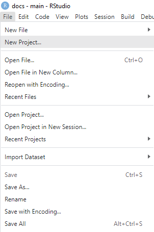

# Getting started

Open RStudio Desktop.

Go to *File \> New Project \> New Directory \> Book project using bookdown*

We now have an example book with all the requisite files. If you want you can simply edit the `.Rmd` files the same way you would edit a Word document and have a functioning book ready to go, but for data documentation purposes, we will dive a little deeper.
