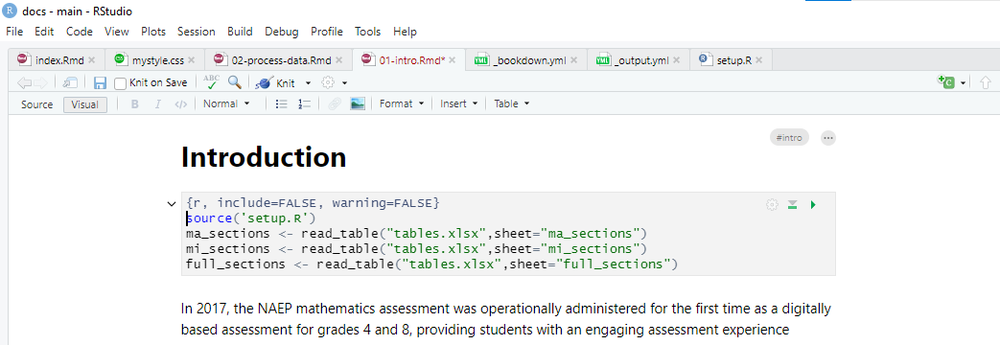

# Appendix: Navigating bookdown

(Skip this section if pressed for time or move to appendix)

Here we take an overview of the main filetypes involved in bookdown and what they are used for.

> Who has worked with `.Rmd`, `.yml`, or `.css` before? What are these filetypes used for?

### `.Rmd`

bookdown is an extension of the R Markdown format, which is itself an extension of the Markdown markup language. 

But you don't need to know Markdown to get started. Toggle the options on the top left of the document window to switch between visual mode, which is similar to a Google Docs or Microsoft Word interface:



And source mode:


See [Resources](#resources) for links to learning R Markdown.

### `.yml`

These files control meta-structure for the book, as well as PDF appearances, via Pandoc and YAML. (If you have a background in web design, think of YAML like CSS for LaTeX, and of LaTeX as HTML for PDFs.)

`_bookdown.yml` controls high-level settings for the book. Let's change where the book outputs to:

```yaml
output_dir: "./MY_DIRECTORY"
```

Sometimes we have a lot of YAML code for one specific section, so we separate this out into another file. For example, `_output.yml` is sourced from `_bookdown.yml` as an `output:` YAML tag

The `output:` tag controls detailed options for the book structure, including download formats, sharing buttons, splitting pages by section, where output is located, and [appearance](https://bookdown.org/yihui/rmarkdown/html-document.html#appearance-and-style).

You can source other files here, such as custom CSS files:

```yaml
---
bookdown::gitbook:
  css: style.css
---
```

### `.css`

Cascading Style Sheets (CSS) are used across the web to control aesthetics. 

This piece is optional, especially for branded materials that may need to align with organizational guidelines. 

It can also be used to customize your output to handle specific cases. For example, I wanted. Let's see an example of how I dealt with this:


Another example is increasing the visible page width for wide content such as tables:

```css
/*Expand table width if needed*/

.book .book-body .page-wrapper .page-inner section.normal {
  overflow: visible !important;
}
.page-inner, .bookbody {
  max-width: 90% !important;
}
.page-inner p, .page-inner h1, .page-inner h2, .page-inner h3, .page-inner h4, .page-inner h5, .page-inner h6, .page-inner li, .page-inner .sourceCode, .page-inner table, .ref, .page-inner .figure, .page-inner .csl-entry {
  max-width: 800px;
  margin-left: auto;
  margin-right: auto;
}
#codebook table, .wide table {
  max-width: 98% !important;
}
```

[insert how I referenced these in the book]
